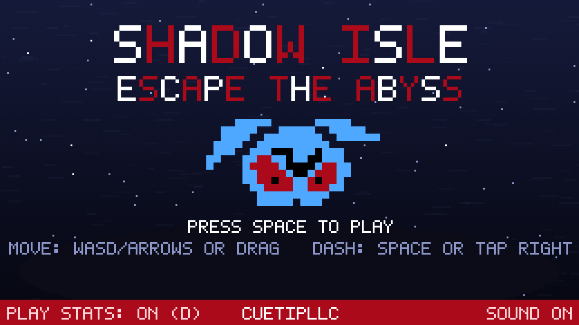
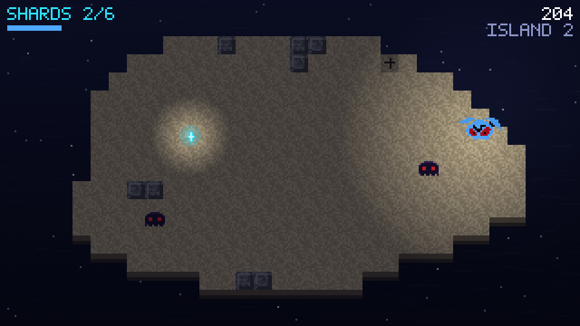
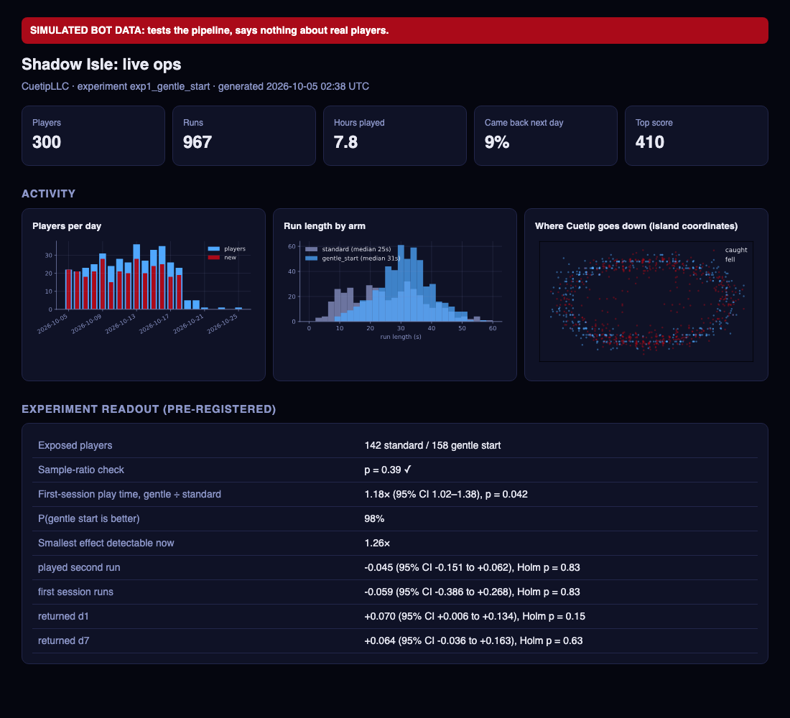

# Shadow Isle: Escape the Abyss

**A browser game by CuetipLLC, instrumented end to end, with a pre-registered A/B test on
real players.**



Cuetip is stranded on a crumbling island in the abyss. Collect soul shards to light the
escape beacon, reach it, and jump to the next island, before the shadows catch you or the
ground falls away. Runs last a minute or two and work with keyboard or touch.

**▶ Play:** *itch.io link goes here after launch* ([launch guide](docs/SETUP.md))



## Why this exists

Most data-science portfolio projects analyze someone else's data. This one runs the whole
loop on a product I made and real people play:

```
game (HTML5 canvas)          telemetry SDK             warehouse                     decisions
┌──────────────────┐  events  ┌──────────────┐  load   ┌─────────────────────────┐   ┌──────────────────┐
│ Shadow Isle      │────────▶│ Supabase      │───────▶│ DuckDB + dbt models     │──▶│ live-ops dashboard│
│ sticky A/B arm   │ batched, │ Postgres,     │         │ stg → runs, sessions,   │   │ pre-registered    │
│ per player       │ offline- │ insert-only   │         │ players, experiment     │   │ experiment readout│
└──────────────────┘ safe     └──────────────┘         │ + 18 data tests         │   └──────────────────┘
                                                        └─────────────────────────┘
```

## The experiment: does a gentler first 30 seconds keep players playing?

| | |
|---|---|
| **Arms** | `standard` vs `gentle_start` (first shadow at 7 s instead of 2.5 s, island crumbles later, shadows at 55% speed until 20 s, then ramping to normal by 35 s) |
| **Unit** | Player, assigned by hashing an anonymous browser id, sticky across visits |
| **Primary metric** | First-session play time (ratio of geometric means, Welch test on log scale) |
| **Secondary** | Played a second run · runs per first session · D1 and D7 return (Holm-adjusted) |
| **Sample** | 200 players or 6 weeks. The plan states what is detectable at that size: about a +35–50% effect |

The full plan, written before launch, is in [`docs/analysis_plan.md`](docs/analysis_plan.md).
**Results: pending launch.**

## What was built

- **The game** (`game/`, no build step, about 16 KB zipped). Pixel art from CuetipLLC's
  Cuetip sprite; a fixed-timestep simulation separate from rendering; a crumbling island,
  shadow AI, dash with invulnerability frames, touch joystick, WebAudio sound effects and a
  bitmap font.
- **Telemetry** (`game/telemetry.js`):
  - anonymous player id, sticky experiment assignment, batched uploads;
  - `keepalive` flush when the tab closes, and an offline queue in localStorage;
  - a one-tap opt-out, and no personal data.
- **Database** (`supabase/schema.sql`). Row-level security lets the public key *insert*
  only, and check constraints cap event names, sizes and arms.
- **Warehouse** (`analytics/`). DuckDB with **dbt**: a staging layer (dedupe, typing, JSON
  parsing) and marts for runs, sessions, players, daily KPIs and the experiment table.
  It has 18 data tests, including "no player in two arms" and "every finished run was
  started".
- **Analysis.** A pre-registered readout (`analytics/experiment.py`) with a sample-ratio
  check, bootstrap CIs, P(better), Holm adjustment, and the minimum detectable effect at
  the current sample size. A live-ops dashboard (`analytics/dashboard.py`) shows players
  per day, run length by arm, and where Cuetip dies on the island.
- **Simulated players for testing** (`tools/run_bots.py`). Headless Chrome runs the *real*
  game code with an AI player and sends events through the real telemetry path, so the
  whole pipeline is tested before any person plays. Bot data is flagged `is_bot` and never
  mixed with real results. Bot *play* is real; bot *decisions to keep playing* follow an
  assumed model, so the dry run tests the code, not the hypothesis.



## Things the tests caught

- **Biased experiment assignment.** The first version split players with `FNV-1a(id) % 2`.
  FNV's lowest bit is just the XOR of the input characters' lowest bits, so arms were
  assigned by character parity, and switching the experiment id flipped *every* player to
  the other arm instead of reshuffling. A unit test caught it; a hash finalizer
  (MurmurHash3 `fmix32`) fixed it.
- **Retention measured in the wrong timezone.** DuckDB was computing "came back the next
  day" on Eastern-time days. The warehouse is now pinned to UTC.
- **A difficulty spike** at 20–30 seconds, found in the bot dry run: every run died right as
  the gentle start wore off. The curve was smoothed before launch.

## Run it

```bash
python3 -m venv .venv && .venv/bin/pip install dbt-duckdb duckdb pandas pyarrow scipy statsmodels matplotlib pytest ruff requests
make dev        # play locally: http://localhost:8787/index.html?collector=http://localhost:8787
make dry-run    # 300 simulated players -> warehouse -> dbt -> readout -> dashboard
make test       # Python stats tests + 11 game tests in headless Chrome
make package    # itch.io zip
make live       # after launch: pull real players from Supabase and rebuild everything
```

The bot runs and tests need Google Chrome.

## Layout

```
game/                 the game: index.html, game.js, telemetry.js, sprites.js, config.js
supabase/schema.sql   events table + insert-only security
analytics/            load.py, dbt/ (models + tests), stats.py, experiment.py, dashboard.py
tools/                dev collector, headless bot runner, JS test runner, packager, screenshots
docs/                 analysis_plan.md (pre-registration), SETUP.md (launch guide)
art/                  original Cuetip art and poster (© CuetipLLC)
```

## Credits

Character, art and *Shadow Isle* concept: **CuetipLLC**. Code and analytics: Quinton
McReynolds. Cuetip and the Shadow Isle artwork are not covered by any open-source license.
